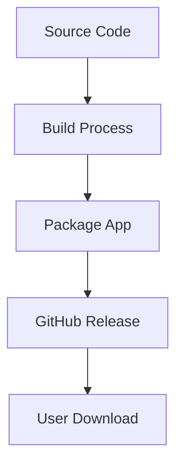
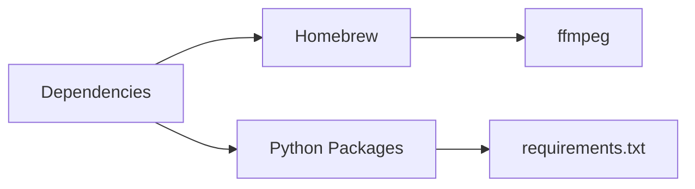
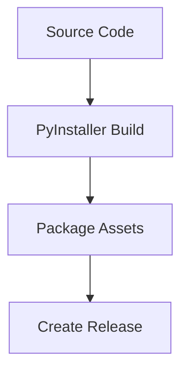
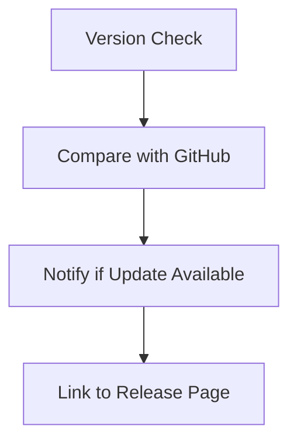

# macOS Packaging and Distribution Plan

## Overview

Simple and straightforward approach to packaging and distributing the Medusa Wavetable Utility for macOS, focusing on GitHub-based distribution and basic version management.

## 1. Package Structure

### CLI Version
- Simple binary package
- Core dependencies bundled
- Basic installation instructions

### GUI Version (.app Bundle)
- Standard macOS .app structure
- Bundled resources and frameworks
- Direct download and run approach

## 2. Dependency Management

- Use Homebrew for ffmpeg installation
- Document dependency requirements clearly
- Add dependency checking on startup
- Provide clear error messages if dependencies missing

## 3. Resource Management

- Images stored in /images/
- Configuration files in user's home directory
- Documentation in GitHub repository
- Clear paths for resource loading

## 4. Build Process

### Build System
- Enhanced PyInstaller spec file
- Automated build process
- Simple version bumping
- Release artifact generation

## 5. Distribution

- GitHub releases as primary distribution method
- Release notes for each version
- Clear download instructions
- Installation guide in README

## 6. Version Management

- Simple version checking against GitHub releases
- User notification of available updates
- Direct links to new versions
- Version history in RELEASE_NOTES.md

## Implementation Phases

1. **Phase 1: Basic Packaging**
   - Setup PyInstaller configuration
   - Implement resource bundling
   - Add dependency checks

2. **Phase 2: GitHub Integration**
   - Setup automated releases
   - Implement version checking
   - Create release documentation

3. **Phase 3: User Experience**
   - Add update notifications
   - Improve error messages
   - Enhance installation guide

## Next Steps

1. Enhance PyInstaller spec file for better resource handling
2. Implement version checking against GitHub releases
3. Create clear installation and update documentation
4. Setup automated build and release process